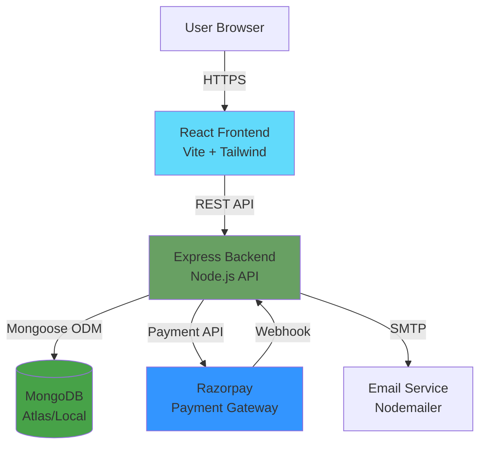
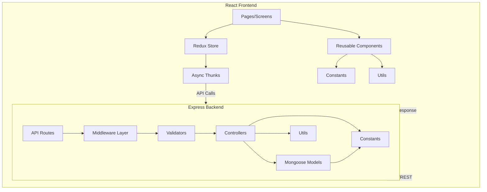
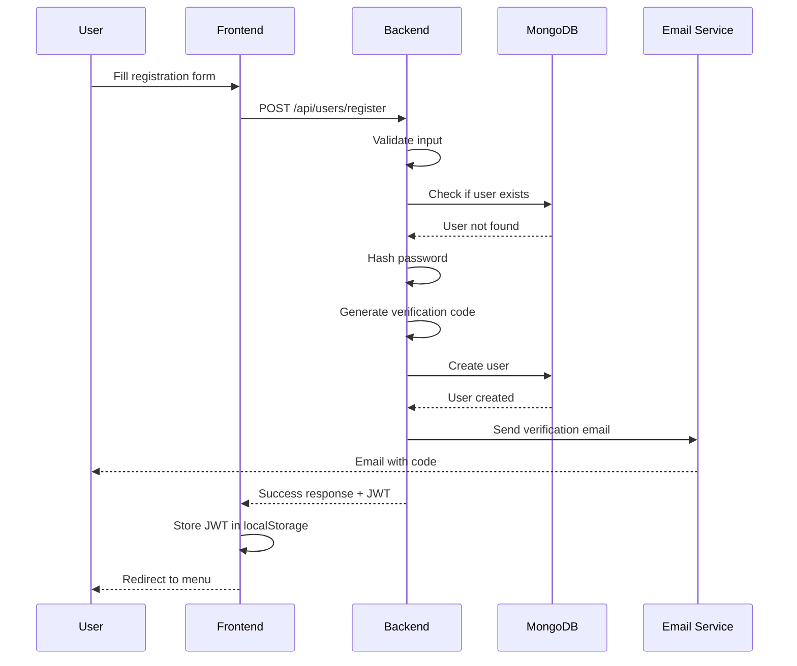
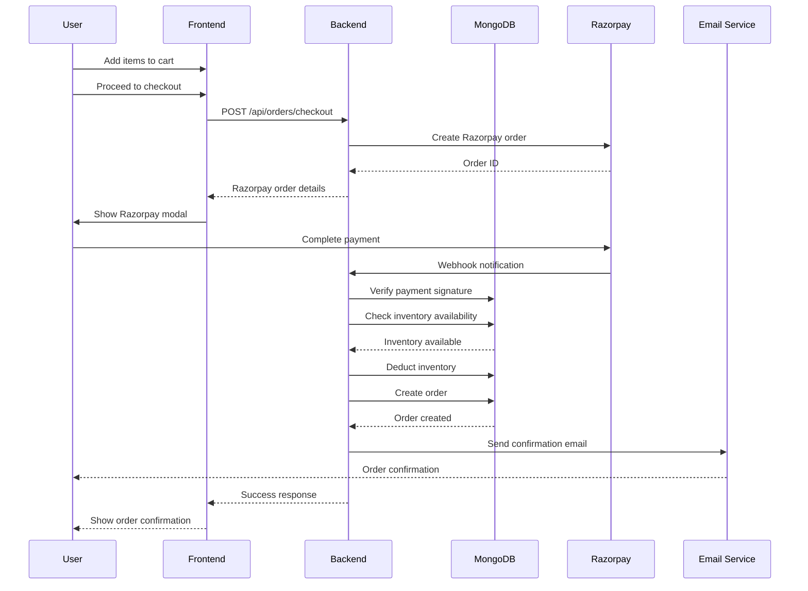
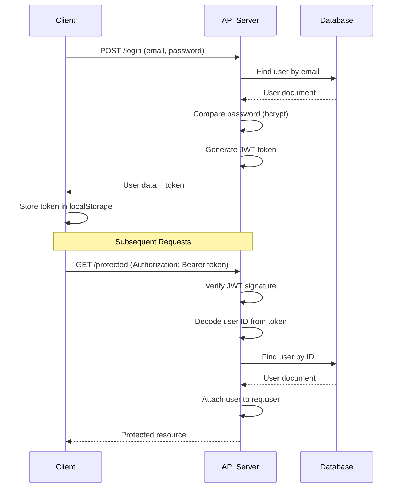
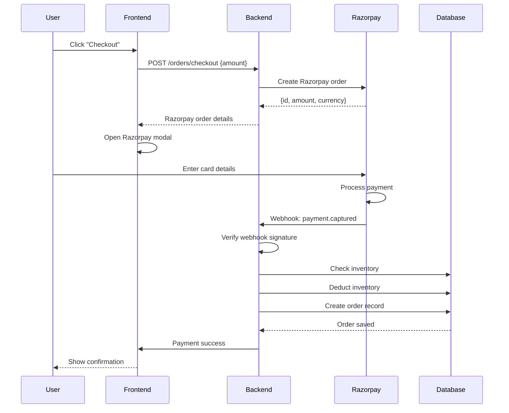
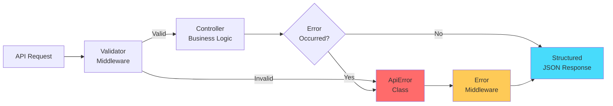
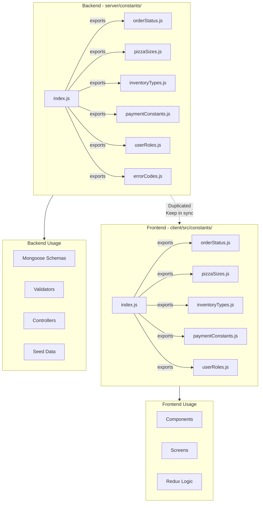
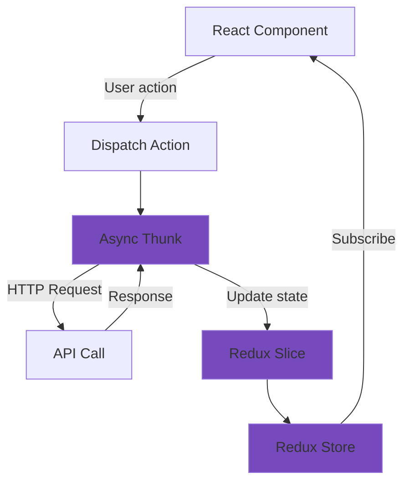
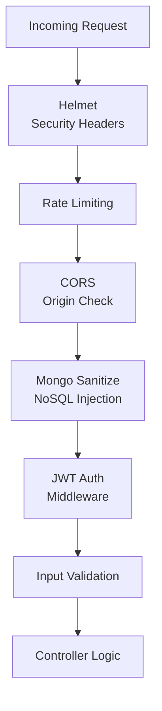

# System Architecture

Comprehensive overview of Pizza Palette's system architecture, design patterns, and data flows.

## Table of Contents

- [Overview](#overview)
- [Technology Stack](#technology-stack)
- [System Architecture](#system-architecture)
- [Folder Structure](#folder-structure)
- [Data Flow](#data-flow)
- [Database Schema](#database-schema)
- [Authentication Flow](#authentication-flow)
- [Payment Flow](#payment-flow)
- [Error Handling](#error-handling)
- [Constants Management](#constants-management)

---

## Overview

Pizza Palette is a full-stack MERN application following modern web development practices:
- **Separation of Concerns**: Frontend and backend are independent deployments
- **RESTful API**: Standard REST principles for API design
- **Stateless Authentication**: JWT-based auth with no server-side sessions
- **Standardized Error Handling**: Structured error responses with codes
- **Centralized Constants**: Single source of truth for enums and types

---

## Technology Stack

### Frontend
- **React 18** - UI library
- **Vite 4** - Build tool and dev server
- **Redux Toolkit** - State management
- **React Router v6** - Client-side routing
- **Tailwind CSS** - Utility-first CSS framework
- **Axios** - HTTP client
- **React Icons** - Icon library

### Backend
- **Node.js** - Runtime environment
- **Express.js** - Web framework
- **Mongoose** - MongoDB ODM
- **JWT** - Authentication
- **bcryptjs** - Password hashing
- **express-validator** - Input validation
- **Nodemailer** - Email sending
- **Razorpay SDK** - Payment processing

### Security & Middleware
- **Helmet** - Security headers
- **express-mongo-sanitize** - NoSQL injection prevention
- **express-rate-limit** - Rate limiting
- **CORS** - Cross-origin resource sharing

### Database
- **MongoDB** - NoSQL database
- **Mongoose** - ODM with schema validation
- **MongoDB Atlas** - Cloud hosting (production)

### Deployment
- **Vercel** - Frontend and backend (serverless functions)
- **GitHub** - Version control and CI/CD

---

## System Architecture

### High-Level Architecture



### Component Architecture



---

## Folder Structure

### Backend Structure

```
server/
├── config/
│   └── db.js                  # MongoDB connection
├── constants/                  # Centralized constants
│   ├── errorCodes.js
│   ├── orderStatus.js
│   ├── pizzaSizes.js
│   ├── inventoryTypes.js
│   ├── paymentConstants.js
│   ├── userRoles.js
│   └── index.js               # Exports all constants
├── controllers/                # Business logic
│   ├── userControllers.js
│   ├── adminUserControllers.js
│   ├── pizzaControllers.js
│   ├── orderControllers.js
│   ├── inventoryControllers.js
│   └── analyticsControllers.js
├── middlewares/                # Custom middleware
│   ├── authMiddlewares.js     # JWT authentication
│   ├── errorMiddlewares.js    # Error handling
│   ├── validationHandler.js   # Validation processing
│   ├── rateLimitMiddleware.js # Rate limiting
│   └── nodemailerMiddleware.js# Email sending
├── routes/                     # API routes
│   ├── userRoutes.js
│   ├── adminUserRoutes.js
│   ├── pizzaRoutes.js
│   ├── orderRoutes.js
│   ├── inventoryRoutes.js
│   └── analyticsRoutes.js
├── schemas/                    # Mongoose models
│   ├── userSchema.js
│   ├── adminUserSchema.js
│   ├── pizzaSchema.js
│   ├── orderSchema.js
│   └── inventorySchema.js
├── validators/                 # Input validation
│   ├── userValidators.js
│   ├── adminValidators.js
│   ├── pizzaValidators.js
│   ├── orderValidators.js
│   └── inventoryValidators.js
├── utils/                      # Utilities
│   ├── ApiError.js            # Custom error class
│   ├── ApiResponse.js         # Success response wrapper
│   ├── errorCodeMapper.js     # Error code mapping
│   ├── generateToken.js       # JWT generation
│   ├── paginationUtils.js     # Pagination helpers
│   ├── razorpayUtils.js       # Razorpay verification
│   ├── inventoryDeductionUtils.js
│   ├── inventoryAlertUtils.js
│   └── envValidator.js        # Env validation
├── data/                       # Seed data
│   ├── users.js
│   ├── pizzas.js
│   └── inventory.js
├── __tests__/                  # Tests
│   └── utils/
├── index.js                    # Entry point
└── package.json
```

### Frontend Structure

```
client/
├── public/                     # Static assets
├── src/
│   ├── components/
│   │   ├── layout/            # Layout components
│   │   ├── route/             # Route guards
│   │   └── ui/                # Reusable UI components
│   │       ├── Admin/         # Admin components
│   │       ├── Cart/          # Cart components
│   │       ├── CheckoutSteps/ # Checkout flow
│   │       └── ...
│   ├── constants/              # Frontend constants
│   │   ├── orderStatus.js
│   │   ├── pizzaSizes.js
│   │   ├── inventoryTypes.js
│   │   ├── paymentConstants.js
│   │   ├── userRoles.js
│   │   └── index.js
│   ├── redux/
│   │   ├── asyncThunks/       # API calls
│   │   │   ├── userThunks.js
│   │   │   ├── pizzaThunks.js
│   │   │   ├── orderThunks.js
│   │   │   ├── inventoryThunks.js
│   │   │   └── adminThunks.js
│   │   ├── slices/            # Redux slices
│   │   │   ├── userSlice.js
│   │   │   ├── pizzaSlice.js
│   │   │   ├── orderSlice.js
│   │   │   ├── inventorySlice.js
│   │   │   ├── adminSlice.js
│   │   │   └── cartSlice.js
│   │   └── store.js           # Redux store
│   ├── screens/               # Page components
│   │   ├── User/
│   │   ├── Admin/
│   │   └── ...
│   ├── utils/                 # Utilities
│   │   └── errorUtils.js     # Error extraction
│   ├── App.jsx
│   ├── main.jsx              # Entry point
│   └── index.css
├── .env                       # Environment variables
└── package.json
```

---

## Data Flow

### User Registration Flow



### Order Creation Flow



---

## Database Schema

### Core Collections

#### Users Collection
```javascript
{
  _id: ObjectId,
  name: String,
  email: String (unique, indexed),
  password: String (hashed),
  phoneNumber: String,
  address: String,
  isVerified: Boolean,
  verificationCode: String,
  resetPasswordToken: String,
  resetPasswordExpire: Date,
  orders: [ObjectId],
  createdAt: Date,
  updatedAt: Date
}
```

#### Admins Collection
```javascript
{
  _id: ObjectId,
  name: String,
  email: String (unique, indexed),
  password: String (hashed),
  role: String (enum: ['admin', 'manager']),
  permissions: [String],
  isApproved: Boolean (indexed),
  createdAt: Date,
  updatedAt: Date
}
```

#### Pizzas Collection
```javascript
{
  _id: ObjectId,
  name: String,
  description: String,
  bases: [ObjectId] (ref: Base),
  sauces: [ObjectId] (ref: Sauce),
  cheeses: [ObjectId] (ref: Cheese),
  veggies: [ObjectId] (ref: Veggie),
  price: Number,
  size: String (enum: PIZZA_SIZE_VALUES),
  createdBy: String (enum: ['admin', 'user']),
  imageUrl: String,
  createdAt: Date,
  updatedAt: Date
}
```

#### Orders Collection
```javascript
{
  _id: ObjectId,
  user: ObjectId (ref: User, indexed),
  orderItems: [{
    pizza: ObjectId (ref: Pizza),
    qty: Number,
    price: Number
  }],
  deliveryAddress: {
    phoneNumber: String,
    address: String,
    city: String,
    postalCode: String,
    country: String
  },
  salesTax: Number,
  deliveryCharges: Number,
  totalPrice: Number,
  payment: {
    method: String (enum: ['razorpay']),
    razorpayOrderId: String,
    status: String
  },
  status: String (enum: ORDER_STATUS_VALUES, indexed),
  deliveredAt: Date,
  createdAt: Date (indexed),
  updatedAt: Date
}
```

#### Inventory Collections (Base, Sauce, Cheese, Veggie)
```javascript
{
  _id: ObjectId,
  item: String,
  price: Number,
  quantity: Number,
  threshold: Number,
  createdAt: Date,
  updatedAt: Date
}
```

### Database Indexes

Optimized queries with strategic indexing:

```javascript
// Users
email: 1 (unique)
isVerified: 1

// Admins  
email: 1 (unique)
isApproved: 1
role: 1

// Pizzas
createdBy: 1
price: 1
size: 1
createdAt: -1

// Orders
user: 1
status: 1
createdAt: -1
{ user: 1, createdAt: -1 } (compound)
{ status: 1, createdAt: -1 } (compound)
```

---

## Authentication Flow

### JWT-Based Authentication



### Route Protection

**Frontend:**
- `ProtectedRoute` - Requires authentication
- `AdminRoute` - Requires admin role
- `UserRoute` - Requires user role

**Backend:**
- `authenticateUser` - Verifies JWT token
- `authenticateAdmin` - Verifies admin JWT
- `checkAdminApproval` - Checks admin approval status

---

## Payment Flow

### Razorpay Integration



### Payment States
- **Created**: Razorpay order created
- **Authorized**: Payment authorized (pending capture)
- **Captured**: Payment successful
- **Failed**: Payment failed

---

## Error Handling

### Error Architecture



### Error Response Format

```javascript
// Error Response
{
  success: false,
  error: {
    code: 'VALIDATION_ERROR',
    message: 'Please check your input',
    details: [
      { field: 'email', message: 'Email is required' }
    ],
    timestamp: '2026-02-22T...',
    path: '/api/users/login',
    requestId: 'req_abc123'
  }
}

// Success Response
{
  success: true,
  data: { ... },
  message: 'Operation successful'
}
```

See [Error Handling Guide](./ERROR_HANDLING.md) for details.

---

## Constants Management

### Duplicated Constants Architecture



**Why Duplicated?**
- No shared package complexity
- Independent deployment
- Type safety per environment
- Simpler build process

**Keeping in Sync:**
- Manual synchronization when updating
- Both index.js files document this requirement
- Values should always match

See [Constants Guide](./CONSTANTS.md) for complete reference.

---

## State Management

### Redux Architecture



### Redux Slices

1. **userSlice** - User authentication and profile
2. **adminSlice** - Admin authentication
3. **pizzaSlice** - Pizza CRUD operations
4. **orderSlice** - Order management
5. **inventorySlice** - Inventory management
6. **cartSlice** - Shopping cart

---

## Security Architecture

### Security Layers



### Security Features

1. **Helmet** - Sets secure HTTP headers
2. **Rate Limiting** - Prevents brute force attacks
3. **CORS** - Restricts cross-origin requests
4. **Input Sanitization** - Prevents NoSQL injection
5. **JWT Authentication** - Stateless auth
6. **Password Hashing** - bcrypt with salt rounds
7. **express-validator** - Input validation
8. **Razorpay Signature Verification** - Payment security

---

## Performance Optimizations

### Database
- Strategic indexing on frequently queried fields
- Aggregation pipelines for analytics
- Connection pooling (poolSize: 10)
- Efficient populate() queries

### Frontend
- Code splitting with React Router
- Lazy loading of components
- Redux for state management
- Memoization where needed

### Backend
- Pagination for large datasets
- Rate limiting to prevent abuse
- Async/await for non-blocking operations
- Environment-based logging

---

## Scalability Considerations

### Current Architecture
- Monolithic backend
- Single database instance
- Serverless deployment (Vercel)

### Future Scalability
- Microservices architecture
- Database replication
- Caching layer (Redis)
- CDN for static assets
- Load balancing
- Message queues for async tasks

---

## Related Documentation

- [Setup Guide](./SETUP.md) - Installation instructions
- [API Reference](./API.md) - API endpoints
- [Error Handling](./ERROR_HANDLING.md) - Error patterns
- [Constants](./CONSTANTS.md) - Constants reference

---

**Last Updated:** February 22, 2026  
**Version:** 2.0.0
