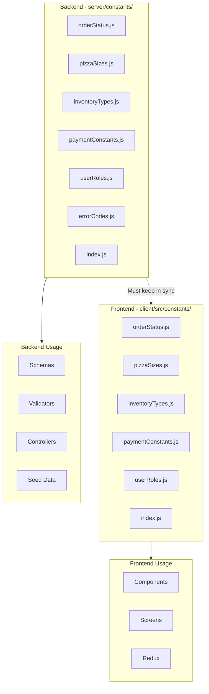

# Constants Reference

Complete reference for all constants used in Pizza Palette application.

## Table of Contents

- [Overview](#overview)
- [Architecture](#architecture)
- [Backend Constants](#backend-constants)
- [Frontend Constants](#frontend-constants)
- [Keeping Constants in Sync](#keeping-constants-in-sync)
- [Usage Examples](#usage-examples)

---

## Overview

Pizza Palette uses a **duplicated constants architecture**:
- Backend constants: `server/constants/`
- Frontend constants: `client/src/constants/`
- Values are duplicated (not shared) for deployment flexibility
- Must be kept manually in sync when changes are made

### Why Duplicated?

✅ **Advantages:**
- No shared package complexity
- Independent deployment of frontend and backend
- Type safety specific to each environment
- Simpler build process
- No monorepo setup required

❌ **Trade-offs:**
- Must manually sync changes
- Duplication of code
- Risk of inconsistency if not careful

---

## Architecture



---

## Backend Constants

**Location:** `server/constants/`

### Order Status

**File:** `server/constants/orderStatus.js`

```javascript
const ORDER_STATUS = Object.freeze({
  RECEIVED: 'Received',
  IN_KITCHEN: 'In the Kitchen',
  OUT_FOR_DELIVERY: 'Sent for Delivery',
  DELIVERED: 'Delivered',
  CANCELLED: 'Cancelled'
});

const ORDER_STATUS_VALUES = Object.values(ORDER_STATUS);

module.exports = { ORDER_STATUS, ORDER_STATUS_VALUES };
```

**Usage:**
```javascript
const { ORDER_STATUS, ORDER_STATUS_VALUES } = require('../constants');

// In schema
status: {
  type: String,
  enum: ORDER_STATUS_VALUES,
  default: ORDER_STATUS.RECEIVED
}

// In validator
body('status').isIn(ORDER_STATUS_VALUES)

// In controller
if (order.status === ORDER_STATUS.DELIVERED) { ... }
```

---

### Pizza Sizes

**File:** `server/constants/pizzaSizes.js`

```javascript
const PIZZA_SIZES = Object.freeze({
  SMALL: 'small',
  MEDIUM: 'medium',
  LARGE: 'large',
  EXTRA_LARGE: 'extra-large'
});

const PIZZA_SIZE_VALUES = Object.values(PIZZA_SIZES);

const PIZZA_SIZE_MULTIPLIERS = Object.freeze({
  [PIZZA_SIZES.SMALL]: 0.8,
  [PIZZA_SIZES.MEDIUM]: 1.0,
  [PIZZA_SIZES.LARGE]: 1.3,
  [PIZZA_SIZES.EXTRA_LARGE]: 1.6
});

module.exports = {
  PIZZA_SIZES,
  PIZZA_SIZE_VALUES,
  PIZZA_SIZE_MULTIPLIERS
};
```

**Usage:**
```javascript
const { PIZZA_SIZES, PIZZA_SIZE_VALUES, PIZZA_SIZE_MULTIPLIERS } = require('../constants');

// In schema
size: {
  type: String,
  enum: PIZZA_SIZE_VALUES,
  required: true
}

// In controller - calculate price based on size
const finalPrice = basePrice * PIZZA_SIZE_MULTIPLIERS[pizza.size];
```

---

### Inventory Types

**File:** `server/constants/inventoryTypes.js`

```javascript
const INVENTORY_TYPES = Object.freeze({
  BASE: 'Base',
  SAUCE: 'Sauce',
  CHEESE: 'Cheese',
  VEGGIE: 'Veggie'
});

const INVENTORY_TYPE_VALUES = Object.values(INVENTORY_TYPES);

module.exports = {
  INVENTORY_TYPES,
  INVENTORY_TYPE_VALUES
};
```

**Usage:**
```javascript
const { INVENTORY_TYPES, INVENTORY_TYPE_VALUES } = require('../constants');

// In validator
body('type')
  .isIn(INVENTORY_TYPE_VALUES)
  .withMessage(`Type must be one of: ${INVENTORY_TYPE_VALUES.join(', ')}`)

// In controller
const bases = await Base.find();
const sauces = await Sauce.find();
```

---

### Payment Constants

**File:** `server/constants/paymentConstants.js`

```javascript
const PAYMENT_METHODS = Object.freeze(['stripe', 'cod']);

const PAYMENT_STATUS = Object.freeze({
  PENDING: 'pending',
  SUCCESS: 'success',
  PAID: 'paid', // For COD when admin confirms payment received
  FAILED: 'failed',
  REFUNDED: 'refunded'
});

const PAYMENT_STATUS_VALUES = Object.values(PAYMENT_STATUS);

// Stripe webhook event types this app handles
const STRIPE_EVENTS = Object.freeze({
  CHECKOUT_COMPLETED: 'checkout.session.completed',
  PAYMENT_FAILED: 'payment_intent.payment_failed'
});

module.exports = {
  PAYMENT_METHODS,
  PAYMENT_STATUS,
  PAYMENT_STATUS_VALUES,
  STRIPE_EVENTS
};
```

**Usage:**
```javascript
const { PAYMENT_METHODS, PAYMENT_STATUS } = require('../constants');

// In order schema
payment: {
  method: {
    type: String,
    enum: PAYMENT_METHODS,
    required: true
  },
  status: {
    type: String,
    enum: PAYMENT_STATUS_VALUES,
    default: PAYMENT_STATUS.PENDING
  }
}
```

---

### User Roles

**File:** `server/constants/userRoles.js`

```javascript
const USER_ROLES = Object.freeze({
  USER: 'user',
  ADMIN: 'admin',
  MANAGER: 'manager'
});

const ADMIN_ROLES = Object.freeze([
  USER_ROLES.ADMIN,
  USER_ROLES.MANAGER
]);

module.exports = {
  USER_ROLES,
  ADMIN_ROLES
};
```

**Usage:**
```javascript
const { USER_ROLES, ADMIN_ROLES } = require('../constants');

// In admin schema
role: {
  type: String,
  enum: ADMIN_ROLES,
  default: USER_ROLES.MANAGER
}

// In middleware
if (req.admin.role === USER_ROLES.ADMIN) { ... }
```

---

### Error Codes

**File:** `server/constants/errorCodes.js`

```javascript
const ERROR_CODES = Object.freeze({
  // Authentication (1xxx)
  INVALID_CREDENTIALS: 'AUTH_1001',
  INVALID_TOKEN: 'AUTH_1002',
  TOKEN_EXPIRED: 'AUTH_1003',
  UNAUTHORIZED: 'AUTH_1004',
  FORBIDDEN: 'AUTH_1005',
  ADMIN_NOT_APPROVED: 'AUTH_1006',

  // Resource (2xxx)
  NOT_FOUND: 'RESOURCE_2001',
  ALREADY_EXISTS: 'RESOURCE_2002',
  
  // Validation (3xxx)
  VALIDATION_ERROR: 'VALIDATION_3001',
  BAD_REQUEST: 'VALIDATION_3002',
  INVALID_INPUT: 'VALIDATION_3003',
  
  // Payment (4xxx)
  PAYMENT_FAILED: 'PAYMENT_4001',
  PAYMENT_VERIFICATION_FAILED: 'PAYMENT_4002',
  
  // Server (5xxx)
  INTERNAL_SERVER_ERROR: 'SERVER_5001',
  DATABASE_ERROR: 'SERVER_5002',
  
  // Other
  UNKNOWN_ERROR: 'UNKNOWN_0000'
});

module.exports = { ERROR_CODES };
```

**Usage:**
```javascript
const { ERROR_CODES } = require('../constants');

throw new ApiError(404, ERROR_CODES.NOT_FOUND, 'Pizza not found');
```

---

### Index File

**File:** `server/constants/index.js`

```javascript
const { ORDER_STATUS, ORDER_STATUS_VALUES } = require('./orderStatus');
const { PIZZA_SIZES, PIZZA_SIZE_VALUES, PIZZA_SIZE_MULTIPLIERS } = require('./pizzaSizes');
const { INVENTORY_TYPES, INVENTORY_TYPE_VALUES } = require('./inventoryTypes');
const { PAYMENT_METHODS, PAYMENT_STATUS, PAYMENT_STATUS_VALUES, STRIPE_EVENTS } = require('./paymentConstants');
const { USER_ROLES, ADMIN_ROLES } = require('./userRoles');
const { ERROR_CODES } = require('./errorCodes');

module.exports = {
  ORDER_STATUS,
  ORDER_STATUS_VALUES,
  PIZZA_SIZES,
  PIZZA_SIZE_VALUES,
  PIZZA_SIZE_MULTIPLIERS,
  INVENTORY_TYPES,
  INVENTORY_TYPE_VALUES,
  PAYMENT_METHODS,
  PAYMENT_STATUS,
  PAYMENT_STATUS_VALUES,
  STRIPE_EVENTS,
  USER_ROLES,
  ADMIN_ROLES,
  ERROR_CODES
};
```

**Usage:**
```javascript
// Import all at once
const {
  ORDER_STATUS,
  PIZZA_SIZES,
  ERROR_CODES
} = require('../constants');

// Or import from specific file
const { ORDER_STATUS } = require('../constants/orderStatus');
```

---

## Frontend Constants

**Location:** `client/src/constants/`

### Order Status

**File:** `client/src/constants/orderStatus.js`

```javascript
export const ORDER_STATUS = Object.freeze({
  RECEIVED: 'Received',
  IN_KITCHEN: 'In the Kitchen',
  OUT_FOR_DELIVERY: 'Sent for Delivery',
  DELIVERED: 'Delivered',
  CANCELLED: 'Cancelled'
});

export const ORDER_STATUS_VALUES = Object.values(ORDER_STATUS);

// UI Helper function
export const getOrderStatusColor = (status) => {
  switch (status) {
    case ORDER_STATUS.RECEIVED:
      return 'bg-yellow-100 text-yellow-800';
    case ORDER_STATUS.IN_KITCHEN:
      return 'bg-blue-100 text-blue-800';
    case ORDER_STATUS.OUT_FOR_DELIVERY:
      return 'bg-purple-100 text-purple-800';
    case ORDER_STATUS.DELIVERED:
      return 'bg-green-100 text-green-800';
    case ORDER_STATUS.CANCELLED:
      return 'bg-red-100 text-red-800';
    default:
      return 'bg-gray-100 text-gray-800';
  }
};
```

**Usage:**
```jsx
import { ORDER_STATUS, getOrderStatusColor } from '../../constants';

// In component
<span className={getOrderStatusColor(order.status)}>
  {order.status}
</span>

// In select dropdown
<select>
  <option value={ORDER_STATUS.RECEIVED}>{ORDER_STATUS.RECEIVED}</option>
  <option value={ORDER_STATUS.IN_KITCHEN}>{ORDER_STATUS.IN_KITCHEN}</option>
</select>
```

---

### Pizza Sizes

**File:** `client/src/constants/pizzaSizes.js`

```javascript
export const PIZZA_SIZES = Object.freeze({
  SMALL: 'small',
  MEDIUM: 'medium',
  LARGE: 'large',
  EXTRA_LARGE: 'extra-large'
});

export const PIZZA_SIZE_VALUES = Object.values(PIZZA_SIZES);

export const PIZZA_SIZE_MULTIPLIERS = Object.freeze({
  [PIZZA_SIZES.SMALL]: 0.8,
  [PIZZA_SIZES.MEDIUM]: 1.0,
  [PIZZA_SIZES.LARGE]: 1.3,
  [PIZZA_SIZES.EXTRA_LARGE]: 1.6
});

// UI Helper - formatted options for select inputs
export const PIZZA_SIZE_OPTIONS = [
  { value: PIZZA_SIZES.SMALL, label: 'Small (0.8x price)' },
  { value: PIZZA_SIZES.MEDIUM, label: 'Medium (1x price)' },
  { value: PIZZA_SIZES.LARGE, label: 'Large (1.3x price)' },
  { value: PIZZA_SIZES.EXTRA_LARGE, label: 'Extra Large (1.6x price)' }
];
```

**Usage:**
```jsx
import { PIZZA_SIZE_OPTIONS, PIZZA_SIZE_MULTIPLIERS } from '../../constants';

// In select dropdown
<select value={size} onChange={(e) => setSize(e.target.value)}>
  {PIZZA_SIZE_OPTIONS.map(option => (
    <option key={option.value} value={option.value}>
      {option.label}
    </option>
  ))}
</select>

// Calculate price
const finalPrice = basePrice * PIZZA_SIZE_MULTIPLIERS[selectedSize];
```

---

### Inventory Types

**File:** `client/src/constants/inventoryTypes.js`

```javascript
export const INVENTORY_TYPES = Object.freeze({
  BASE: 'Base',
  SAUCE: 'Sauce',
  CHEESE: 'Cheese',
  VEGGIE: 'Veggie'
});

export const INVENTORY_TYPE_VALUES = Object.values(INVENTORY_TYPES);

// UI Helper - formatted options
export const INVENTORY_TYPE_OPTIONS = [
  { value: INVENTORY_TYPES.BASE, label: 'Base' },
  { value: INVENTORY_TYPES.SAUCE, label: 'Sauce' },
  { value: INVENTORY_TYPES.CHEESE, label: 'Cheese' },
  { value: INVENTORY_TYPES.VEGGIE, label: 'Veggie' }
];
```

**Usage:**
```jsx
import { INVENTORY_TYPE_OPTIONS } from '../../../constants';

<select>
  {INVENTORY_TYPE_OPTIONS.map(option => (
    <option key={option.value} value={option.value}>
      {option.label}
    </option>
  ))}
</select>
```

---

### Payment Constants

**File:** `client/src/constants/paymentConstants.js`

```javascript
export const PAYMENT_METHODS = Object.freeze(['stripe', 'cod']);

export const PAYMENT_METHOD_LABELS = Object.freeze({
  stripe: 'Credit/Debit Card (Stripe)',
  cod: 'Cash on Delivery'
});

export const PAYMENT_STATUS = Object.freeze({
  PENDING: 'pending',
  SUCCESS: 'success',
  PAID: 'paid', // For COD when admin confirms payment received
  FAILED: 'failed',
  REFUNDED: 'refunded'
});

export const PAYMENT_STATUS_VALUES = Object.values(PAYMENT_STATUS);
```

---

### User Roles

**File:** `client/src/constants/userRoles.js`

```javascript
export const USER_ROLES = Object.freeze({
  USER: 'user',
  ADMIN: 'admin',
  MANAGER: 'manager'
});

export const ADMIN_ROLES = Object.freeze([
  USER_ROLES.ADMIN,
  USER_ROLES.MANAGER
]);

// UI Helper
export const isAdminRole = (role) => ADMIN_ROLES.includes(role);
```

---

## Keeping Constants in Sync

### Checklist When Updating Constants

When you modify a constant:

1. **Update Backend**
   - [ ] Update `server/constants/<file>.js`
   - [ ] Update `server/constants/index.js` if needed
   - [ ] Update schemas using the constant
   - [ ] Update validators using the constant
   - [ ] Update controllers using the constant
   - [ ] Update seed data if applicable

2. **Update Frontend**
   - [ ] Update `client/src/constants/<file>.js`
   - [ ] Update `client/src/constants/index.js` if needed
   - [ ] Update components using the constant
   - [ ] Update screens using the constant
   - [ ] Update Redux slices if applicable

3. **Test**
   - [ ] Run backend tests
   - [ ] Test API endpoints
   - [ ] Test frontend UI
   - [ ] Verify validation still works
   - [ ] Check database operations

### Example: Adding New Order Status

**1. Backend - Update `orderStatus.js`:**
```javascript
const ORDER_STATUS = Object.freeze({
  RECEIVED: 'Received',
  IN_KITCHEN: 'In the Kitchen',
  OUT_FOR_DELIVERY: 'Sent for Delivery',
  DELIVERED: 'Delivered',
  CANCELLED: 'Cancelled',
  REFUNDED: 'Refunded'  // NEW
});
```

**2. Frontend - Update `orderStatus.js`:**
```javascript
export const ORDER_STATUS = Object.freeze({
  RECEIVED: 'Received',
  IN_KITCHEN: 'In the Kitchen',
  OUT_FOR_DELIVERY: 'Sent for Delivery',
  DELIVERED: 'Delivered',
  CANCELLED: 'Cancelled',
  REFUNDED: 'Refunded'  // NEW
});

// Update helper function
export const getOrderStatusColor = (status) => {
  // ... existing cases
  case ORDER_STATUS.REFUNDED:
    return 'bg-orange-100 text-orange-800';
  // ...
};
```

**3. Update Schema:**
Already using `ORDER_STATUS_VALUES`, so no change needed.

**4. Update Validators:**
Already using `ORDER_STATUS_VALUES`, so no change needed.

**5. Update UI Components:**
Add new status to dropdowns and display logic.

---

## Usage Examples

### Example 1: Creating Pizza with Constants

**Backend:**
```javascript
const { PIZZA_SIZES, USER_ROLES } = require('../constants');

const pizza = new Pizza({
  name: 'Margherita',
  size: PIZZA_SIZES.MEDIUM,
  createdBy: USER_ROLES.ADMIN,
  // ...
});
```

**Frontend:**
```jsx
import { PIZZA_SIZE_OPTIONS } from '../../constants';

<select>
  {PIZZA_SIZE_OPTIONS.map(opt => (
    <option key={opt.value} value={opt.value}>{opt.label}</option>
  ))}
</select>
```

### Example 2: Order Status Updates

**Backend:**
```javascript
const { ORDER_STATUS } = require('../constants');

// Update order status
order.status = ORDER_STATUS.IN_KITCHEN;
await order.save();
```

**Frontend:**
```jsx
import { ORDER_STATUS, getOrderStatusColor } from '../../constants';

<span className={getOrderStatusColor(order.status)}>
  {order.status}
</span>
```

### Example 3: Validation

**Backend:**
```javascript
const { INVENTORY_TYPE_VALUES } = require('../constants');

const createStockValidation = [
  body('type')
    .isIn(INVENTORY_TYPE_VALUES)
    .withMessage(`Type must be one of: ${INVENTORY_TYPE_VALUES.join(', ')}`)
];
```

---

## Related Documentation

- [Architecture](./ARCHITECTURE.md) - Constants architecture diagram
- [API Reference](./API.md) - API endpoints using constants
- [Error Handling](./ERROR_HANDLING.md) - Error codes

---

**Last Updated:** February 22, 2026  
**Version:** 2.0.0
