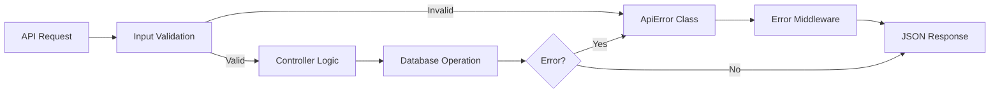

# Error Handling Guide

Comprehensive guide to the standardized error handling system in Pizza Palette.

## Table of Contents

- [Overview](#overview)
- [Error Response Structure](#error-response-structure)
- [ApiError Class](#apierror-class)
- [Error Codes Reference](#error-codes-reference)
- [Backend Error Handling](#backend-error-handling)
- [Frontend Error Handling](#frontend-error-handling)
- [Best Practices](#best-practices)
- [Examples](#examples)

---

## Overview

Pizza Palette implements enterprise-grade error handling with:
- **Structured Error Responses**: Consistent JSON format
- **Error Codes**: Machine-readable error identifiers
- **Field-Level Details**: Validation errors with specific field information
- **Request Tracking**: Unique request IDs for debugging
- **User-Friendly Messages**: Clear, actionable error messages

### Error Flow



---

## Error Response Structure

### Standard Error Response

```javascript
{
  success: false,
  error: {
    code: string,           // Machine-readable error code
    message: string,        // Human-readable message
    details: array,         // Optional field-level details
    timestamp: string,      // ISO 8601 timestamp
    path: string,           // API endpoint
    requestId: string       // Unique request identifier
  }
}
```

### Success Response

```javascript
{
  success: true,
  data: object | array,    // Response data
  message: string,         // Success message
  metadata: object         // Optional metadata (pagination, etc.)
}
```

### Example Error Response

```javascript
// Validation Error
{
  "success": false,
  "error": {
    "code": "VALIDATION_ERROR",
    "message": "Please check your input",
    "details": [
      {
        "field": "email",
        "message": "Email is required",
        "value": ""
      },
      {
        "field": "password",
        "message": "Password must be at least 6 characters",
        "value": "12345"
      }
    ],
    "timestamp": "2026-02-22T10:30:00.000Z",
    "path": "/api/users/register",
    "requestId": "req_a1b2c3d4e5"
  }
}
```

---

## ApiError Class

### Location
`server/utils/ApiError.js`

### Usage

```javascript
const ApiError = require('../utils/ApiError');
const { ERROR_CODES } = require('../constants/errorCodes');

// Basic usage
throw new ApiError(404, ERROR_CODES.NOT_FOUND, 'Pizza not found');

// With details
throw new ApiError(
  400,
  ERROR_CODES.VALIDATION_ERROR,
  'Validation failed',
  [{ field: 'email', message: 'Invalid format' }]
);
```

### Factory Methods

#### Authentication Errors

```javascript
// Invalid credentials
ApiError.invalidCredentials(message?);
// Status: 401, Code: INVALID_CREDENTIALS

// Token errors
ApiError.invalidToken(message?);
// Status: 401, Code: INVALID_TOKEN

ApiError.tokenExpired(message?);
// Status: 401, Code: TOKEN_EXPIRED

// Unauthorized access
ApiError.unauthorized(message?);
// Status: 401, Code: UNAUTHORIZED
```

#### Authorization Errors

```javascript
// Forbidden access
ApiError.forbidden(message?);
// Status: 403, Code: FORBIDDEN

// Admin not approved
ApiError.adminNotApproved(message?);
// Status: 403, Code: ADMIN_NOT_APPROVED
```

#### Resource Errors

```javascript
// Resource not found
ApiError.notFound(resourceType, identifier?);
// Status: 404, Code: NOT_FOUND

// Resource already exists
ApiError.alreadyExists(resourceType, identifier?);
// Status: 409, Code: ALREADY_EXISTS
```

#### Validation Errors

```javascript
// Validation error with details
ApiError.validation(message, details);
// Status: 400, Code: VALIDATION_ERROR

// Bad request
ApiError.badRequest(message);
// Status: 400, Code: BAD_REQUEST
```

#### Payment Errors

```javascript
// Payment failed
ApiError.paymentFailed(message?);
// Status: 400, Code: PAYMENT_FAILED

// Payment verification failed
ApiError.paymentVerificationFailed(message?);
// Status: 400, Code: PAYMENT_VERIFICATION_FAILED
```

#### Server Errors

```javascript
// Internal server error
ApiError.internal(message?);
// Status: 500, Code: INTERNAL_SERVER_ERROR

// Database error
ApiError.databaseError(message?);
// Status: 500, Code: DATABASE_ERROR
```

### Example: Controller Usage

```javascript
const ApiError = require('../utils/ApiError');
const { ERROR_CODES } = require('../constants/errorCodes');

const getPizzaById = async (req, res, next) => {
  try {
    const pizza = await Pizza.findById(req.params.id);
    
    if (!pizza) {
      throw ApiError.notFound('Pizza', req.params.id);
    }
    
    res.json(ApiResponse.success(pizza, 'Pizza retrieved'));
  } catch (error) {
    next(error);
  }
};
```

---

## Error Codes Reference

### Location
`server/constants/errorCodes.js`

### All Error Codes

```javascript
const ERROR_CODES = {
  // Authentication (1xxx)
  INVALID_CREDENTIALS: 'AUTH_1001',
  INVALID_TOKEN: 'AUTH_1002',
  TOKEN_EXPIRED: 'AUTH_1003',
  UNAUTHORIZED: 'AUTH_1004',
  FORBIDDEN: 'AUTH_1005',
  ADMIN_NOT_APPROVED: 'AUTH_1006',

  // Resource (2xxx)
  NOT_FOUND: 'RESOURCE_2001',
  ALREADY_EXISTS: 'RESOURCE_2002',
  
  // Validation (3xxx)
  VALIDATION_ERROR: 'VALIDATION_3001',
  BAD_REQUEST: 'VALIDATION_3002',
  INVALID_INPUT: 'VALIDATION_3003',
  
  // Payment (4xxx)
  PAYMENT_FAILED: 'PAYMENT_4001',
  PAYMENT_VERIFICATION_FAILED: 'PAYMENT_4002',
  
  // Server (5xxx)
  INTERNAL_SERVER_ERROR: 'SERVER_5001',
  DATABASE_ERROR: 'SERVER_5002',
  
  // Other
  UNKNOWN_ERROR: 'UNKNOWN_0000'
};
```

### Error Code Mapping

```javascript
// Maps HTTP status codes to generic error codes
const statusToErrorCode = {
  400: 'BAD_REQUEST',
  401: 'UNAUTHORIZED',
  403: 'FORBIDDEN',
  404: 'NOT_FOUND',
  409: 'ALREADY_EXISTS',
  500: 'INTERNAL_SERVER_ERROR'
};
```

---

## Backend Error Handling

### Error Middleware

**Location:** `server/middlewares/errorMiddlewares.js`

The error middleware handles:
- ApiError instances
- Mongoose validation errors
- Mongoose CastError (invalid ObjectId)
- MongoDB duplicate key errors (E11000)
- JWT errors
- Generic errors

### Process Flow

1. **ApiError**: Return structured response
2. **Mongoose ValidationError**: Extract field errors
3. **Mongoose CastError**: Invalid ID format
4. **MongoDB E11000**: Duplicate key violation
5. **JsonWebTokenError**: Invalid JWT
6. **TokenExpiredError**: Expired JWT
7. **Generic Error**: Convert to ApiError

### Example: Mongoose Validation Error

**Input:**
```javascript
// Mongoose validation error
{
  name: 'ValidationError',
  errors: {
    email: { message: 'Email is required', path: 'email' },
    password: { message: 'Password too short', path: 'password' }
  }
}
```

**Output:**
```javascript
{
  "success": false,
  "error": {
    "code": "VALIDATION_ERROR",
    "message": "Validation failed",
    "details": [
      { "field": "email", "message": "Email is required" },
      { "field": "password", "message": "Password too short" }
    ],
    "timestamp": "2026-02-22T...",
    "path": "/api/users/register",
    "requestId": "req_..."
  }
}
```

### Validation Handler

**Location:** `server/middlewares/validationHandler.js`

Processes `express-validator` results:

```javascript
const validationHandler = (req, res, next) => {
  const errors = validationResult(req);
  
  if (!errors.isEmpty()) {
    const details = errors.array().map(error => ({
      field: error.path || error.param,
      message: error.msg,
      value: error.value
    }));
    
    throw new ApiError(
      400,
      ERROR_CODES.VALIDATION_ERROR,
      'Validation failed',
      details
    );
  }
  
  next();
};
```

---

## Frontend Error Handling

### Error Utilities

**Location:** `client/src/utils/errorUtils.js`

#### extractErrorMessage

Extracts user-friendly error message from various error formats:

```javascript
import { extractErrorMessage } from '../../utils/errorUtils';

const errorMessage = extractErrorMessage(error);
// Returns: "User-friendly error message"
```

Handles:
- Structured errors: `{ code, message, details }`
- Legacy errors: `{ status, message }`
- String errors: `"Error message"`
- Axios errors: `{ response: { data: { error: ... } } }`

#### getFieldErrors

Extracts field-level validation errors:

```javascript
import { getFieldErrors } from '../../utils/errorUtils';

const fieldErrors = getFieldErrors(error);
// Returns: [{ field: 'email', message: 'Invalid' }]
```

#### getErrorCode

Extracts error code:

```javascript
import { getErrorCode } from '../../utils/errorUtils';

const code = getErrorCode(error);
// Returns: "VALIDATION_ERROR"
```

### Message Component

**Location:** `client/src/components/ui/Message.jsx`

Displays errors in a consistent, user-friendly format:

```jsx
import Message from './components/ui/Message';

// String error
<Message variant="error">Something went wrong</Message>

// Auto-detect variant from error object
<Message>{error}</Message>

// With explicit variant
<Message variant="warning">{error}</Message>
```

Features:
- Auto-detects error type and severity
- Displays field-level validation errors
- Shows error codes
- Auto-dismiss after 8 seconds
- Manual close button

### Redux Thunk Error Handling

All async thunks use `extractErrorMessage` helper:

```javascript
import { extractErrorMessage } from './helpers';

export const loginUser = createAsyncThunk(
  'user/login',
  async (credentials, { rejectWithValue }) => {
    try {
      const { data } = await axios.post('/api/users/login', credentials);
      return data.data || data;
    } catch (error) {
      return rejectWithValue(extractErrorMessage(error));
    }
  }
);
```

### Displaying Errors in Components

```jsx
import { useSelector } from 'react-redux';
import Message from './components/ui/Message';
import { extractErrorMessage } from './utils/errorUtils';

function LoginScreen() {
  const { error, loading } = useSelector((state) => state.user);
  
  return (
    <>
      {error && <Message>{error}</Message>}
      {/* ... rest of component */}
    </>
  );
}
```

---

## Best Practices

### Backend

1. **Always use ApiError for known errors**
   ```javascript
   // ✅ Good
   throw ApiError.notFound('Pizza', id);
   
   // ❌ Bad
   throw new Error('Pizza not found');
   ```

2. **Let error middleware handle errors**
   ```javascript
   // ✅ Good
   const controller = async (req, res, next) => {
     try {
       // ... logic
     } catch (error) {
       next(error);  // Pass to error middleware
     }
   };
   
   // ❌ Bad
   const controller = async (req, res, next) => {
     try {
       // ... logic
     } catch (error) {
       res.status(500).json({ error: error.message });
     }
   };
   ```

3. **Use validation middleware**
   ```javascript
   // ✅ Good
   router.post(
     '/register',
     registerValidation,
     validationHandler,
     registerUser
   );
   ```

4. **Provide helpful error messages**
   ```javascript
   // ✅ Good
   throw ApiError.validation(
     'Invalid pizza size',
     [{ field: 'size', message: `Must be one of: ${PIZZA_SIZES}` }]
   );
   
   // ❌ Bad
   throw ApiError.badRequest('Invalid size');
   ```

### Frontend

1. **Use error utilities for consistency**
   ```javascript
   // ✅ Good
   const message = extractErrorMessage(error);
   
   // ❌ Bad
   const message = error?.response?.data?.error?.message || 'Error';
   ```

2. **Display errors in Message component**
   ```javascript
   // ✅ Good
   {error && <Message>{error}</Message>}
   
   // ❌ Bad
   {error && <div className="error">{error.message}</div>}
   ```

3. **Handle errors in Redux thunks**
   ```javascript
   // ✅ Good - thunk handles error
   extraReducers: (builder) => {
     builder.addCase(fetchData.rejected, (state, action) => {
       state.error = action.payload;  // Structured error
     });
   }
   ```

4. **Clear errors on new requests**
   ```javascript
   // ✅ Good
   builder.addCase(fetchData.pending, (state) => {
     state.error = null;
     state.loading = true;
   });
   ```

---

## Examples

### Example 1: Not Found Error

**Backend:**
```javascript
const getPizzaById = async (req, res, next) => {
  try {
    const pizza = await Pizza.findById(req.params.id);
    
    if (!pizza) {
      throw ApiError.notFound('Pizza', req.params.id);
    }
    
    res.json(ApiResponse.success(pizza));
  } catch (error) {
    next(error);
  }
};
```

**Response:**
```javascript
{
  "success": false,
  "error": {
    "code": "RESOURCE_2001",
    "message": "Pizza not found: 507f1f77bcf86cd799439011",
    "timestamp": "2026-02-22T10:30:00.000Z",
    "path": "/api/pizzas/507f1f77bcf86cd799439011",
    "requestId": "req_abc123"
  }
}
```

**Frontend:**
```jsx
{pizzaError && <Message>{pizzaError}</Message>}
// Displays: "Pizza not found: 507f1f77bcf86cd799439011"
```

### Example 2: Validation Error

**Backend:**
```javascript
// validators/userValidators.js
const registerValidation = [
  body('email')
    .notEmpty().withMessage('Email is required')
    .isEmail().withMessage('Invalid email format'),
  body('password')
    .isLength({ min: 6 }).withMessage('Password must be at least 6 characters')
];

// routes/userRoutes.js
router.post(
  '/register',
  registerValidation,
  validationHandler,  // Throws ApiError with details
  registerUser
);
```

**Response:**
```javascript
{
  "success": false,
  "error": {
    "code": "VALIDATION_3001",
    "message": "Email is required",
    "details": [
      { "field": "email", "message": "Email is required", "value": "" },
      { "field": "password", "message": "Password must be at least 6 characters", "value": "12345" }
    ],
    "timestamp": "2026-02-22T10:30:00.000Z",
    "path": "/api/users/register",
    "requestId": "req_abc123"
  }
}
```

**Frontend:**
```jsx
<Message>{error}</Message>
// Displays:
// ⚠️ Warning (VALIDATION_3001): Email is required
// • email: Email is required
// • password: Password must be at least 6 characters
```

### Example 3: Authentication Error

**Backend:**
```javascript
const loginUser = async (req, res, next) => {
  try {
    const { email, password } = req.body;
    const user = await User.findOne({ email });
    
    if (!user || !(await user.comparePassword(password))) {
      throw ApiError.invalidCredentials();
    }
    
    const token = generateToken(user._id);
    res.json(ApiResponse.loginSuccess(user, token));
  } catch (error) {
    next(error);
  }
};
```

**Response:**
```javascript
{
  "success": false,
  "error": {
    "code": "AUTH_1001",
    "message": "Invalid email or password",
    "timestamp": "2026-02-22T10:30:00.000Z",
    "path": "/api/users/login",
    "requestId": "req_abc123"
  }
}
```

### Example 4: Payment Error

**Backend:**
```javascript
const verifyPayment = async (req, res, next) => {
  try {
    const { razorpay_order_id, razorpay_payment_id, razorpay_signature } = req.body;
    
    const isValid = verifyRazorpaySignature(razorpay_order_id, razorpay_payment_id, razorpay_signature);
    
    if (!isValid) {
      throw ApiError.paymentVerificationFailed();
    }
    
    // ... create order
    res.json(ApiResponse.created(order, 'Order created successfully'));
  } catch (error) {
    next(error);
  }
};
```

---

## Common Errors

### VALIDATION_ERROR

**Cause:** Input validation failed
**Status:** 400
**Solution:** Check field-level details and correct input

### INVALID_CREDENTIALS

**Cause:** Wrong email or password
**Status:** 401
**Solution:** Verify credentials

### UNAUTHORIZED

**Cause:** Missing or invalid JWT token
**Status:** 401
**Solution:** Login again

### FORBIDDEN

**Cause:** Insufficient permissions
**Status:** 403
**Solution:** Contact admin for access

### NOT_FOUND

**Cause:** Resource doesn't exist
**Status:** 404
**Solution:** Verify resource ID

### ALREADY_EXISTS

**Cause:** Duplicate resource (e.g., email already registered)
**Status:** 409
**Solution:** Use different identifier

### PAYMENT_FAILED

**Cause:** Payment processing failed
**Status:** 400
**Solution:** Try different payment method or card

---

## Related Documentation

- [API Reference](./API.md) - API endpoints
- [Constants](./CONSTANTS.md) - Error codes reference
- [Architecture](./ARCHITECTURE.md) - Error flow diagram

---

**Last Updated:** February 22, 2026  
**Version:** 2.0.0
